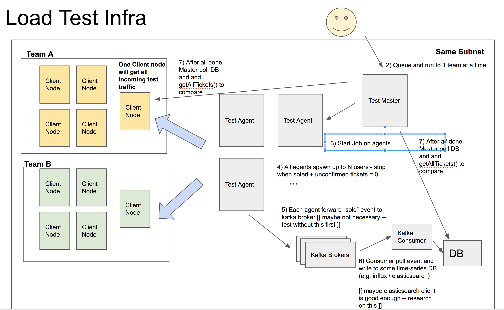

# strength-load
Load Testing for Strength project


## Running
### Prerequisite
* Java 8 `brew cask install adoptopenjdk/openjdk/adoptopenjdk8`
* sbt `brew install sbt`

### Running Tests
```
sbt gatling:test
```

### Example Result
```
================================================================================
---- Global Information --------------------------------------------------------
> request count                                         30 (OK=24     KO=6     )
> min response time                                      1 (OK=2      KO=1     )
> max response time                                     22 (OK=22     KO=12    )
> mean response time                                    11 (OK=12     KO=6     )
> std deviation                                          7 (OK=7      KO=4     )
> response time 50th percentile                          9 (OK=10     KO=6     )
> response time 75th percentile                         20 (OK=20     KO=10    )
> response time 95th percentile                         21 (OK=21     KO=12    )
> response time 99th percentile                         22 (OK=22     KO=12    )
> mean requests/sec                                     30 (OK=24     KO=6     )
---- Response Time Distribution ------------------------------------------------
> t < 800 ms                                            24 ( 80%)
> 800 ms < t < 1200 ms                                   0 (  0%)
> t > 1200 ms                                            0 (  0%)
> failed                                                 6 ( 20%)
---- Errors --------------------------------------------------------------------
> status.find.is(200), but actually found 403                         3 (50.00%)
> jsonPath($.success).find.is(true), but actually found false         3 (50.00%)
================================================================================
```

## Diagram



## Aggregrating Gatling result 
set GATLING_HOME environment variable to local gatling setup
```
./gatling-aggregate.sh
```